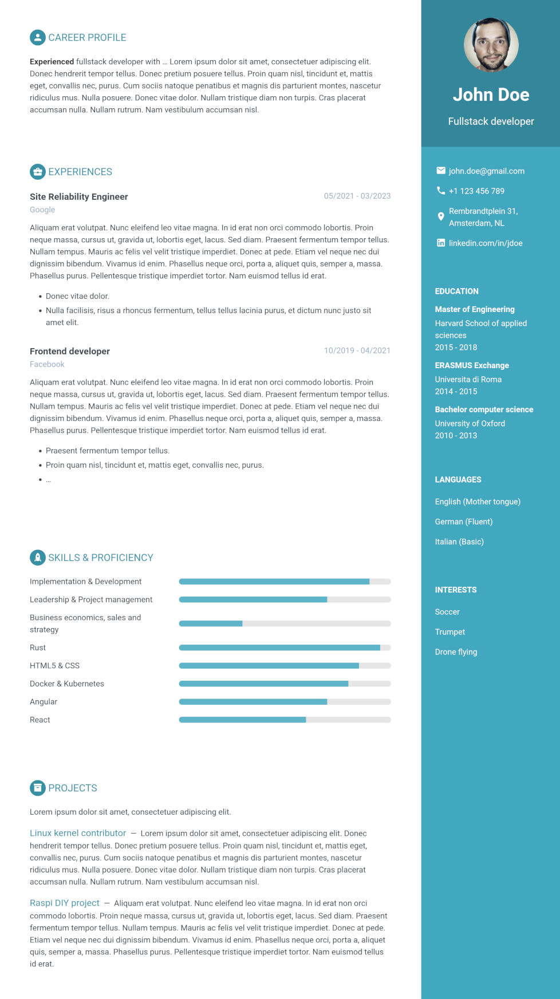

## Content management

### Sections

The theme uses the following sections to build your CV.

In the profile area in the sidebar:

* contact
* education
* languages
* interests

In the main content:

* motivation (also known as cover letter)
* summary
* experiences
* skills
* projects



Find the full section documentation in the [sections.md](./sections.md).


#### Exclude sections

You can exclude certain sections from your CV.
In your `config.toml` add the section identifiers to the `exclude` array.

See below how to exclude different sections per variant.


### Multiple variants

Hugo Sphere theme allows you to create your CV in different languages.
It also helps you managing multiple variants of your CV, e.g. for employer-related adjustments to some content.

#### Content translation

It's recommended to use [translation by filename](https://gohugo.io/content-management/multilingual/#translation-by-file-name).
This way all variants of a section are listed next to each other by your IDE or file manager.
Hence, applying changes to a section across multiple variants means editing file siblings instead of changing directories.

```
.
├── profile
│   ├── contact.de.md
│   ├── contact.en.md
│   ├── education.de.md
│   ├── education.en.md
│   ├── _index.de-aws.md
│   ├── _index.de.md
│   ├── _index.md
│   ├── interests.de.md
│   ├── interests.en.md
│   ├── languages.de.md
│   ├── languages.en.md
```

Have a look at the `_index.md`.
Note that we don't have to use a language code suffix for the default language.

#### Configuration

[Hugo's multilingual mode](https://gohugo.io/content-management/multilingual/) lets you configure multiple languages in your `config.toml`:

```toml
DefaultContentLanguage = "en"
[languages]
  [languages.en]
    languageName = "English" # this will appear in the variants picker
    title = "John Doe - CV"
  [languages.de]
    languageName = "Deutsch"
    title = "John Doe - Lebenslauf"
  [languages.de-aws] # simply create variants of a language...
    languageName = "AWS (de)"
    title = "John Doe - Lebenslauf (AWS)"
    [languages.de-aws.params]
      exclude = ["contact"] # ... and have different settings for them
```

You can configure base languages (`en/de/...`) and then create language variants using the region part (`-aws`) of the language code.

The `languageName** can be used to define the items of the variant picker.
If no `languageName** is set the language code is used.

Each language and variant can have their own parameters.
This let's you exclude certain sections for some variants or use different styles per language.

**NOTE**: Missing parameters are inherited from the default language (not from the base language).


#### Inheritance

The theme offers a certain level of inheritance across languages and variants.
If no content is found for a certain section in the current language variant content from the base language is used.
If there's none in the base language it's taken from the default language.

Looking at the `exampleSite` we've got the following content

```
.
├── skills.de.md
├── skills.md
├── summary.de-aws.md
└── summary.en.md
```

I.e. the skills are available in English (`skills.md`) and German (`skills.de.md`).
Note that we don't have to use a language code suffix for the default language.
As there's no AWS-specific skill content the German skills are included in the AWS variant.

On the German base variant the english summary will be shown (there's **no** `summary.de.md`) while there is a specific summary for the AWS variant (`summary.de-aws.md`).

This can be applied to all sections including experiences and projects.

## Styling

You can specify one of six different styles for your CV.
Simple set the `style` parameter in your `config.toml`.

```toml
# "style1", "style2", "style3", ..., "style6" are available.
style = "style1"
```

You may even define different styles for certain variants.

TODO add theme screenshot
